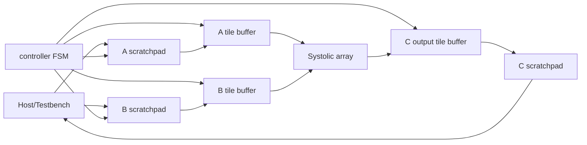

# Architecture

## Block Diagram



## Dataflow

The accelerator computes signed integer GEMM with an output-stationary
systolic array. Each PE owns one accumulator for one C tile element. A values
move across rows, B values move down columns, and partial sums stay local until
the output tile is complete.

Conceptually, the controller executes:

```text
for tile_m in M:
  for tile_n in N:
    clear C accumulators
    for tile_k in K:
      load A tile
      load B tile
      compute partial C tile
      drain systolic wavefront
    capture C accumulator tile
    store C tile
```

## Local Buffers

`tile_buffer.sv` is a small register-backed local buffer used for:

- `A[TILE_M][TILE_K]`
- `B[TILE_K][TILE_N]`
- `C[TILE_M][TILE_N]`

A and B are loaded from scratchpads before compute. C is captured from the PE
accumulators after the final K tile, then written to the C scratchpad during
the store phase.

## Controller FSM

| State | Purpose |
| --- | --- |
| `IDLE` | wait for `start` with nonzero `cfg_m`, `cfg_n`, and `cfg_k` |
| `CLEAR` | clear PE accumulators and C output tile buffer |
| `LOAD` | issue one A read and one B read per cycle into local tile buffers |
| `COMPUTE` | stream one K slice per cycle into the systolic array |
| `DRAIN` | let the systolic wavefront finish propagating |
| `CAPTURE` | copy PE accumulator outputs into the C tile buffer |
| `STORE` | write active C tile elements to the C scratchpad |
| `DONE` | assert `done` for one cycle |

The design has deterministic cycle behavior. Each K tile uses a fixed number
of load, compute, and drain cycles based on the tile parameters. Edge tiles are
zero-padded in the local buffers, and only active output rows/columns are
stored.

## Parameter Assumptions

The practical verified configurations are:

- `DATA_WIDTH = 8`
- `ACC_WIDTH = 32`
- `TILE_M/TILE_N/TILE_K = 2/2/2`
- `TILE_M/TILE_N/TILE_K = 4/4/4`

Runtime matrix dimensions are supplied with `cfg_m`, `cfg_n`, and `cfg_k`.
The verification flow covers dimensions both divisible and not divisible by
the tile sizes.
